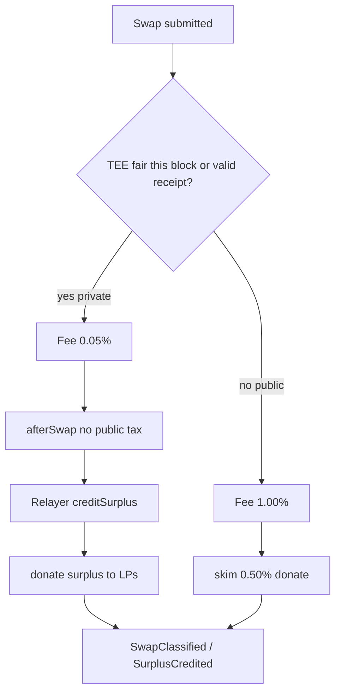
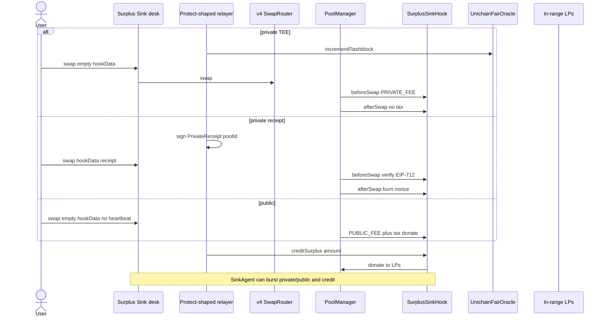
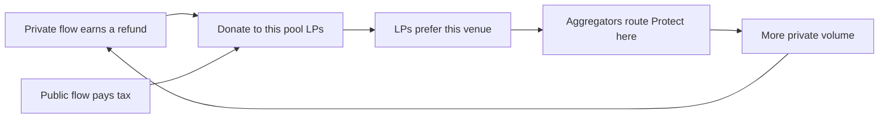

# Surplus Sink

[](./LICENSE)
[](https://docs.uniswap.org/contracts/v4/overview)
[](https://sepolia.uniscan.xyz)

**Live desk:** [uhi10-surplus-sink.vercel.app](https://uhi10-surplus-sink.vercel.app) · **Pitch:** [uhi10-surplus-sink-pitch.vercel.app](https://uhi10-surplus-sink-pitch.vercel.app) · **Pool:** ssVOL / ssUSD · **Hook:** [`0xc3EE9eC810aE91419ba70B78561e69E3Db0450c4`](https://sepolia.uniscan.xyz/address/0xc3EE9eC810aE91419ba70B78561e69E3Db0450c4)

> Private orderflow already sits beside Uniswap. This pool is the refund address.

---

## The idea

Surplus Sink is a **Uniswap v4 hook that makes a Uniswap pool the settlement destination for Flashbots Protect / MEV-Share–shaped surplus**.

Private order-flow systems exist **off to the side** of Uniswap. Refunds and backrun shares go to the user, the builder, or an off-chain pipe. The LPs who took the other side get nothing.

This hook closes that gap with **two ingresses and one LP sink**:

1. **Private path** — TEE / Flashtestation heartbeat (`policy.isFair`) **or** an EIP-712 `PrivateReceipt` signed by an owner-set Protect-style relayer, bound to this `poolId`. Fee **0.05%**, no public tax. Relayer later **`creditSurplus`** real tokens; the hook `donate`s them to in-range LPs.
2. **Public path** — empty `hookData`, no heartbeat. Fee **1.00%** plus a **0.50% recapture tax** donated to the same LPs.

Same book. No mock verifier in `src/`. Receipts are burned so they cannot be replayed.

---

## The problem it solves

- **Protect refunds the user, not the LP.** The inventory that was arb’d is still LP inventory. Surplus Sink pays the LP.
- **MEV-Share is a hint marketplace.** Without a pool-level sink, Uniswap is just another OF source. With a sink, **this venue internalizes its own MEV**.
- Homegrown “CoW” routers in past cohorts did not speak Protect. The unique execution is a **real relayer + donate interface**.
- Attestation-only hooks ask “was the *block* fair?” Surplus Sink asks “did *this swap* come in privately, and where did the refund go?”

---

## How it works

The hook **does not** call Flashbots. It verifies a seam, then settles tokens.

**On-chain**

1. **`beforeSwap`** — private if empty `hookData` and `policy.isFair(block.number)`, or if `hookData` decodes a valid unused receipt (`ecrecover` ∈ `isRelayer`). Else public. Expired / bad signatures revert `Expired` / `BadReceipt`.
2. **`afterSwap`** — public: skim `PUBLIC_TAX_BIPS` and donate. Private: burn the receipt (if any); no tax.
3. **`creditSurplus(key, amountOn0, amount)`** — `only` `isRelayer`. `safeTransferFrom` → `poolManager.unlock` → `donate` + `settle`.

**Off-chain**

The address Flashbots (or your TEE builder) pays is `setRelayer`’d. It signs receipts and later credits surplus. Do not claim a testnet key *is* Flashbots mainnet; claim **signed receipt + real donate**.



---

## Complete user flow



---

## Hook functions implemented

| Surface | Permission | Behavior |
|---|---|---|
| `getHookPermissions` | — | `afterInitialize`, `beforeSwap`, `afterSwap`, `afterSwapReturnDelta` |
| `_afterInitialize` | `afterInitialize` | require dynamic-fee flag |
| `_beforeSwap` | `beforeSwap` | private vs public fee override |
| `_afterSwap` | `afterSwap` + return delta | public recapture; consume receipt |
| `creditSurplus` | relayer + nonReentrant | pull tokens, donate via unlock |
| `unlockCallback` | PoolManager only | donate + settle + `SurplusCredited` |
| `setRelayer` | owner | allowlist Protect-shaped signer |
| `SinkAgent.arm` / `burstPrivate` / `burstPublic` / `credit` | agent | desk traffic |
| `UnichainFairOracle.incrementFlashblock` | builder | TEE-shaped private empty `hookData` |

`PRIVATE_FEE = 500`, `PUBLIC_FEE = 10_000`, `PUBLIC_TAX_BIPS = 50`. Receipt typehash: `PrivateReceipt(uint256 deadline,uint256 nonce,bytes32 poolId)`.

---

## Deployments — Unichain Sepolia (chainId 1301)

| Contract | Address |
|---|---|
| **SurplusSinkHook** | [`0xc3EE9eC810aE91419ba70B78561e69E3Db0450c4`](https://sepolia.uniscan.xyz/address/0xc3EE9eC810aE91419ba70B78561e69E3Db0450c4) |
| **UnichainFairOracle** | [`0xF5D7dcFA8ae0323fCd5dEcC70938465849304627`](https://sepolia.uniscan.xyz/address/0xF5D7dcFA8ae0323fCd5dEcC70938465849304627) |
| **SinkAgent** | [`0x60aB4A85e44F5BD59A03A0b247493e16583dCa30`](https://sepolia.uniscan.xyz/address/0x60aB4A85e44F5BD59A03A0b247493e16583dCa30) |
| Relayer (owner-set) | [`0x4b992F2Fbf714C0fCBb23baC5130Ace48CaD00cd`](https://sepolia.uniscan.xyz/address/0x4b992F2Fbf714C0fCBb23baC5130Ace48CaD00cd) |
| ssVOL (token0) | [`0x5CB7273e88F6f17E5a5051AfC2bD8D8A2f90de0E`](https://sepolia.uniscan.xyz/address/0x5CB7273e88F6f17E5a5051AfC2bD8D8A2f90de0E) |
| ssUSD (token1) | [`0x9Cf385638a1091c59B86625C34EA4E1cCCADf6E4`](https://sepolia.uniscan.xyz/address/0x9Cf385638a1091c59B86625C34EA4E1cCCADf6E4) |
| PoolManager | [`0x00B036B58a818B1BC34d502D3fE730Db729e62AC`](https://sepolia.uniscan.xyz/address/0x00B036B58a818B1BC34d502D3fE730Db729e62AC) |
| SwapRouter | [`0x9cD2b0a732dd5e023a5539921e0FD1c30E198Dba`](https://sepolia.uniscan.xyz/address/0x9cD2b0a732dd5e023a5539921e0FD1c30E198Dba) |
| PositionManager | [`0xf969Aee60879C54bAAed9F3eD26147Db216Fd664`](https://sepolia.uniscan.xyz/address/0xf969Aee60879C54bAAed9F3eD26147Db216Fd664) |
| Permit2 | [`0x000000000022D473030F116dDEE9F6B43aC78BA3`](https://sepolia.uniscan.xyz/address/0x000000000022D473030F116dDEE9F6B43aC78BA3) |
| StateView | [`0xf17D00ffF19D395712ea2Ee16E962a60eBa530BC`](https://sepolia.uniscan.xyz/address/0xf17D00ffF19D395712ea2Ee16E962a60eBa530BC) |

Pool fee flag: `8388608` (dynamic). Tick spacing: `60`. Deploy block: `61520875`. See `frontend/src/deployed.json`.

---

## Integrations

| Partner / layer | How Surplus Sink uses it |
|---|---|
| **Uniswap v4** | dynamic fees, donate, unlock/settle |
| **OpenZeppelin uniswap-hooks** | `BaseHook` |
| **Flashbots Protect / MEV-Share** | EIP-712 receipts + `creditSurplus` as the sink (relayer-shaped) |
| **Unichain Flashtestations / FlashblockNumber** | empty-`hookData` private lane via `UnichainFairOracle` |
| **Permit2 + POSM** | LP from the desk |
| **viem + v4 SDK** | private vs public swap, surplus tape |

---

## Why this is a business

You are selling **the only Uniswap-native address Protect-style refunds can settle into**, plus a public-path tax so mempool flow cannot free-ride the private lane.



**Unit economics (v1)**

- **LP take:** 100% of public skim + 100% of credited surplus. That is inventory insurance LPs do not get from vanilla v4 or from Protect-to-EOA refunds.
- **Private trader take:** 0.05% fee + sandwich resistance from the private RPC. v1 can send 100% of refunds to LPs and still be the only pool that *can* receive them; a later user/LP split is a product toggle, not a new hook.
- **Flashbots / relayer take:** distribution. Wallets keep Protect pointed at **pools that speak the adapter**. You are infrastructure, not a fork of Flashbots.
- **Protocol take (later):** a spread on *public tax* and/or *surplus credits*, never a penalty on the private 0.05% retail fee. Two MEV-native lines: “mempool tax” and “private surplus routing.”

**Go-to-market:** list as a Protect-compatible pool, then wallets/RPCs, then LPs on pairs that already leak to MEV-Share. `SinkAgent` is the demo keeper; production is the relayer you already pay.

**UHI10 fit:** hybrid routing between private orderflow and Uniswap. Directory cheat code: almost nobody integrated Flashbots. Win condition: defense (private path) + recapture (`donate`).

---

## What this is not

Not Fair Path (no slot schedule, no slash). Not Sold Backrun (no backrun NFT). Not a claim that the Sepolia relayer *is* Flashbots mainnet.

## Tests and layout

`forge test` — public tax, private receipt, replay, TEE heartbeat, `creditSurplus`, agent, invariants, fork.

```
src/SurplusSinkHook.sol  src/UnichainFairOracle.sol  src/SinkAgent.sol
test/  script/  frontend/  pitch/
```

## Hookathon gates

Public repo · valid v4 hook · live UI · Protect-shaped + Unichain TEE seams · original UHI10 work.
