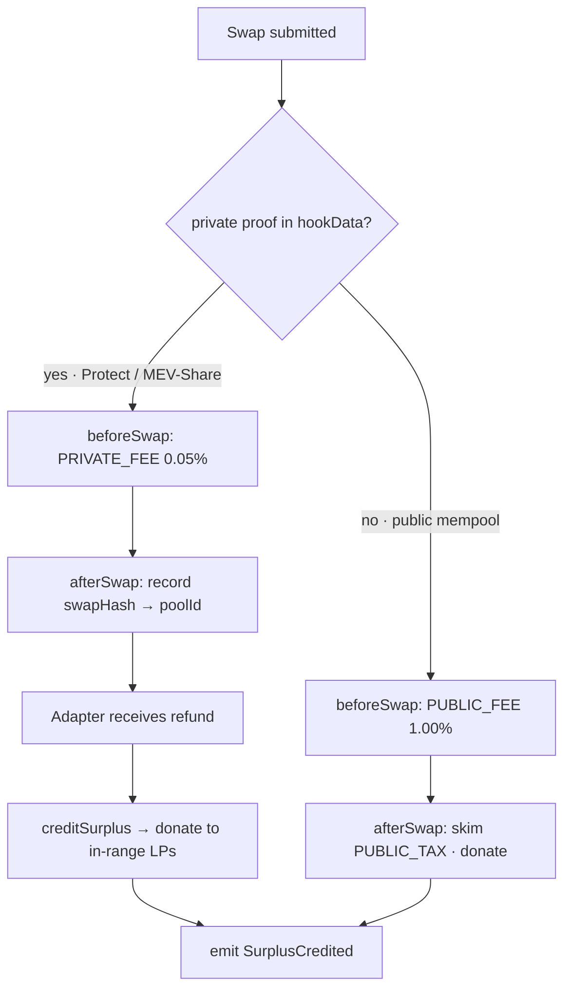
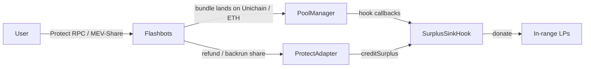
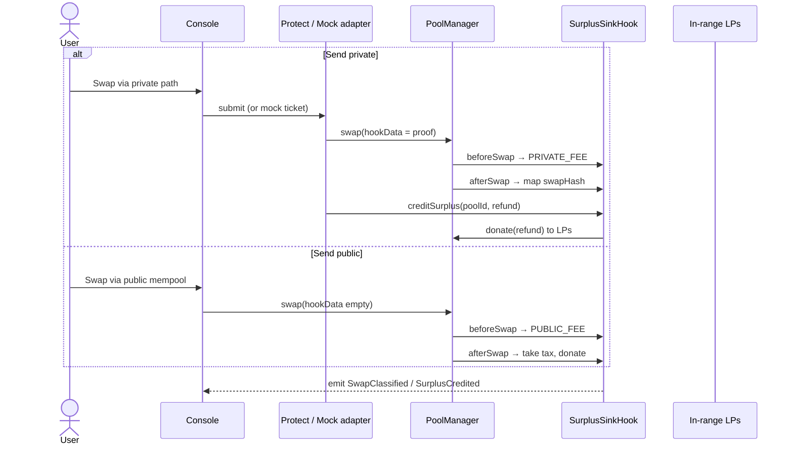
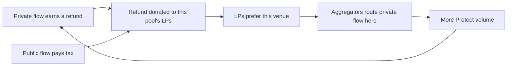

# Surplus Sink

[](./LICENSE)
[](https://docs.uniswap.org/contracts/v4/overview)

UHI10 — *Sustainable Liquidity & MEV Protection*

> **Private orderflow sits beside Uniswap. This hook is the first pool that is the refund address.**

---

## The idea

**Surplus Sink is a Uniswap v4 hook that makes a Uniswap pool the settlement destination for Flashbots Protect / MEV-Share surplus.**

Private order-flow systems already exist. They sit **off to the side** of Uniswap (UHI10 theme problem #5). Refunds and backrun shares go to the user, the builder, or an off-chain accounting pipe. The pool that created the MEV — the LPs who took the other side — gets nothing.

Surplus Sink closes that gap:

- **Private path** (Protect / MEV-Share): the swap still lands in the v4 pool. Inclusion proofs or refund callbacks **credit the hook**. The hook **`donate`s that surplus to in-range LPs**.
- **Public path**: no proof, no refund. The swap is priced as **unattested toxic flow** (premium fee + recapture tax), so public mempool flow cannot free-ride the private lane.

Same pool. Two ingresses. One LP sink.

This is the official UHI10 **hybrid-routing** prompt with a partner **none of the 660 prior directory rows integrated**: Flashbots Protect / MEV-Share. Fourteen homegrown "CoW" matchers exist. Zero Protect.

## The problem it solves

- **Protect refunds the user, not the LP.** The inventory that was arb'd is still LP inventory. Surplus Sink pays the LP.
- **MEV-Share is a hint marketplace.** Without a pool-level sink, Uniswap is just another orderflow source. With a sink, **this pool is the venue that internalizes its own MEV**.
- **Fake hybrid routers** in past cohorts matched intents off-chain and called it CoW. They did not speak Protect. Unique execution for UHI10 is a **real interface**, even if the demo uses a recorded refund adapter.
- **Attestation-only hooks** (Fair Flow / Fair Path corridor 1) ask "was the *block* fair?" Surplus Sink asks "did *this swap* come in privately, and where did the refund go?" Both are fair-flow. They are not the same question.

## How it works

There are two honest layers. Do not pretend the hook can see Flashbots from inside `beforeSwap` without a proof.

**On-chain (the hook)**

1. **`beforeSwap`** — if `hookData` carries a valid **private-path proof** (builder commitment, Protect inclusion attestation, or MEV-Share refund receipt bound to this swap), return **private fee** (`PRIVATE_FEE`, 0.05%). Else return **public fee** (`PUBLIC_FEE`, 1.00%).
2. **`afterSwap`** — public path: skim `PUBLIC_TAX_BIPS` of the output and `donate` to LPs (same recapture shape as Fair Flow). Private path: no tax; wait for surplus.
3. **`creditSurplus(poolId, amount)`** — called by the **refund adapter** (Protect refund receiver / MEV-Share settlement). Pulls tokens, `donate`s to that pool, bumps `totalSurplusDonated`.

**Off-chain (the adapter)**

- Demo: `MockProtectAdapter` anyone can call `simulateRefund(poolId, amount)` so judges can click **Send private** and watch the LP pot tick.
- Production: adapter is a contract authorized by the hook, whose only job is to receive Protect / MEV-Share refunds and call `creditSurplus` with the pool that originated the swap (swap hash → poolId map written in `afterSwap`).





## Proof model — how the hook knows a path is private

The hook **does not** call Flashbots. It verifies a **seam**, the same way Fair Path verifies Flashtestations:

```solidity
interface IPrivatePathVerifier {
    /// @notice True if `proof` binds this swap to a private orderflow path.
    function isPrivate(bytes calldata proof, bytes32 swapHash) external view returns (bool);
}

interface ISurplusReceiver {
    function creditSurplus(PoolId poolId, uint256 amount) external;
}
```

| | Demo (this repo) | Production |
|---|---|---|
| Verifier | `MockProtectVerifier` — frontend passes `abi.encode(true)` or a signed demo ticket | Flashbots Protect inclusion / MEV-Share refund receipt / builder commitment |
| Refunds | `MockProtectAdapter.simulateRefund` | Authorized adapter only, tokens actually received from Protect |
| Why | Judges click Send private vs Send public | Only genuine private flow gets the cheap lane **and** the surplus donate |

**Honest boundary.** If Protect cannot pay a pool contract today, the adapter is the product until it can. The hook's job is still real: **fee by path + donate of whatever surplus arrives.** Do not claim in the video that a mock refund is a live Protect payment. Claim the **interface** and show the donate.

## Complete user flow



## Hook functions implemented

| Function | Permission | What it does |
|---|---|---|
| `getHookPermissions` | — | `afterInitialize`, `beforeSwap`, `afterSwap`, `afterSwapReturnDelta`. |
| `_afterInitialize` | `afterInitialize` | Require dynamic-fee flag. |
| `_beforeSwap` | `beforeSwap` | Verify private proof; override `PRIVATE_FEE` or `PUBLIC_FEE`. |
| `_afterSwap` | `afterSwap` + return delta | Public: recapture tax. Private: record `swapHash → poolId`. |
| `creditSurplus` | — | Adapter-only; `donate` surplus to the mapped pool. |

**On-chain parameters & state**

| Name | Value / type | Meaning |
|---|---|---|
| `PRIVATE_FEE` | `500` (0.05%) | Fee when the private-path proof verifies |
| `PUBLIC_FEE` | `10_000` (1.00%) | Fee when it does not |
| `PUBLIC_TAX_BIPS` | `50` (0.50%) | Output skim donated on the public path |
| `totalSurplusDonated[poolId]` | `uint256` | Protect / MEV-Share credits donated |
| `totalPublicTaxDonated[poolId]` | `uint256` | Public-path recapture |
| `swapPool[swapHash]` | `PoolId` | Routing key for the adapter |
| `SwapClassified` | `event` | Private vs public, fee, tax |
| `SurplusCredited` | `event` | Adapter, pool, amount |

## Integrations

| Layer | Integration | Used for |
|---|---|---|
| **Uniswap v4 core** | `PoolManager`, dynamic-fee override, `donate`, `CurrencySettler` | Path-priced fees + LP sink |
| **OpenZeppelin** | `uniswap-hooks` `BaseHook` | Hook base |
| **Flashbots** | Protect RPC, MEV-Share refunds (production); `IPrivatePathVerifier` + adapter (this repo) | Private ingress + surplus |
| **Frontend / SDK** | `viem`, React, `@uniswap/v4-sdk` | Send private vs Send public, LP pot, event tape |

**Partner integrations (hookathon README requirement)**

- **Flashbots Protect / MEV-Share** — this is the partner. The repo ships `IPrivatePathVerifier`, `ISurplusReceiver`, `MockProtectVerifier`, and `MockProtectAdapter` so the frontend can prove the hook's donate path without a live refund in the first demo. Production binds the same interfaces to Protect / MEV-Share. No other partners are claimed. Future integrations are not listed.

## Why it's profitable — as an idea and a business



**For LPs.** They finally get the MEV their inventory created when users routed privately *and* a tax when users did not.

**For private-path traders.** Cheap fee (0.05%) plus sandwich resistance from Protect. They do not lose the refund — the design can split user vs LP later; v1 can send 100% to LPs and still be the only pool that *can* receive it.

**For Flashbots.** A Uniswap-native sink is a reason for searchers and wallets to keep Protect pointed at **pools that speak the adapter**. That is a distribution story, not a fork.

**For the protocol.** Two fee lines: public tax, private surplus. Both MEV-native. Neither taxes attested/private retail as a penalty.

**Why it fits UHI10.** Official prompt: hybrid routing between private orderflow and Uniswap. Official cheat code: **0 / 660 Flashbots integrations**. Win condition: defense (private path) + recapture (donate).

## What this is not

- Not Fair Path (no flashblock slot schedule, no searcher slash).
- Not Sold Backrun (no on-pool backrun NFT / auction).
- Not a homegrown CoW matcher.
- Not a claim that the mock adapter *is* Flashbots. The README and the video must say **seam + mock**, then **donate is real**.

## The console (to be built)

Judge path — two buttons:

1. **Send private** — proof in `hookData`, 0.05% fee, then `simulateRefund` (demo) or wait for adapter credit; LP surplus ticker moves.
2. **Send public** — 1.00% + 0.50% tax; recapture ticker moves. Optional sandwich visualisation on the public path only.

Pages: Overview, Swap (two corridors), Surplus tape, How it works (Protect diagram).

## Testing (to be built)

- **Unit** — private proof → `PRIVATE_FEE` and no public tax; empty hookData → `PUBLIC_FEE` + tax; only adapter can `creditSurplus`; unknown `swapHash` reverts; donate amount equals credit.
- **Integration** — private swap then refund; public swap then tax; mixed sequence; `totalSurplusDonated` vs `totalPublicTaxDonated` isolation.
- **Fuzz** — public tax = `PUBLIC_TAX_BIPS` of output; surplus credits never hit the public-tax accumulator.
- **Negative** — spoofed proof against the mock's rules; unauthorized `creditSurplus`.

## Repository layout (target)

```
src/
  SurplusSinkHook.sol
  MockProtectVerifier.sol
  MockProtectAdapter.sol
  interfaces/IPrivatePathVerifier.sol
  interfaces/ISurplusReceiver.sol
test/
  SurplusSinkHook.t.sol
  MockProtect.t.sol
frontend/
  src/pages/{Overview,Swap,Surplus,About}*
```

## Hookathon gates

- Public repo (this repository)
- Valid Uniswap v4 hook
- Functioning frontend that calls the hook
- README partner integrations: Flashbots Protect / MEV-Share (interfaces + mocks; donate path is the on-chain proof)
- Video: Send private vs Send public, LP tickers, one sentence on the adapter boundary, no AI voice
- Original work for UHI10; not a resubmission of Fair Flow
